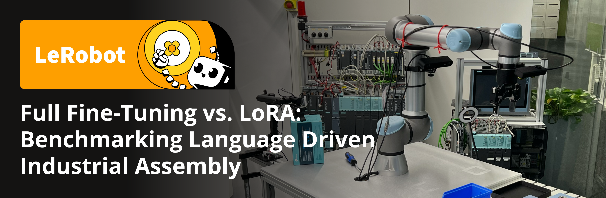
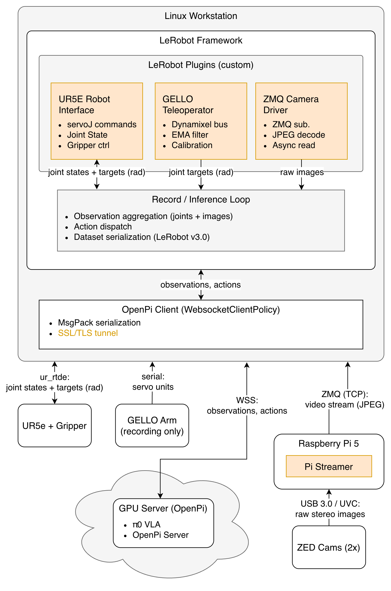

# LeRobot UR5e/Gello



A ready-to-use [LeRobot](https://github.com/huggingface/lerobot) integration for the **UR5e** with the **GELLO** teleoperation device. Collect demonstration datasets, train VLA policies, and deploy them on real hardware through LeRobot's plugin system.

## Features

- **UR5e robot plugin** — RTDE-based control of the UR5e arm with Robotiq gripper
- **GELLO teleoperator plugin** — Dynamixel-based 7-DOF haptic leader arm for intuitive teleoperation
- **ZMQ camera plugin** — stream cameras from Raspberry Pi over the network
- **Remote policy inference** — deploy OpenPI (π0) policies via WebSocket from a GPU server
- **Multi-camera support** — ZED 2i, ZED Mini, and USB cameras

## Hardware Requirements

- Universal Robots UR5e with Robotiq gripper
- [GELLO](https://wuphilipp.github.io/gello_site/) teleoperation device
- One or more cameras (ZED 2i / ZED Mini / USB)
- (Optional) Raspberry Pi 5 for edge camera streaming
- (Optional) GPU server for policy inference



## Installation

Requires Python ≥ 3.11 and [uv](https://github.com/astral-sh/uv).

```bash
uv pip install lerobot -e ./lerobot_camera_zmq -e ./lerobot_robot_ur5e -e ./lerobot_teleoperator_gello
```

## Usage

### Calibrate GELLO Teleop

1. Find the serial port:
```bash
uv run lerobot-find-port
```

2. Run calibration:
```bash
uv run scripts/calibrate_gello_teleop.py --port /dev/ttyUSB0 --id gello_teleop
```

### Record a Dataset

```bash
uv run scripts/record.py \
    --robot.type=ur5e \
    --robot.ip=192.168.1.10 \
    --dataset.num_episodes=50 \
    --dataset.single_task="Pick up the bolt and insert it into the hole." \
    --dataset.push_to_hub=False \
    --teleop.type=gello \
    --teleop.port=/dev/ttyUSB0 \
    --teleop.id=gello_teleop \
    --dataset.repo_id=<your-hf-username>/<dataset-name>
```

### Delete Episodes and Push to Hub

```bash
uv run lerobot-edit-dataset \
    --repo_id=<your-hf-username>/<dataset-name> \
    --operation.type delete_episodes \
    --operation.episode_indices "[0]" \
    --push_to_hub=True
```

### Run Inference with π0

1. **Set up the policy server** (on a GPU machine):

    The server code is available at [openpi-ur5e](https://github.com/F-Fer/openpi-ur5e).

    Download and serve a checkpoint:
    ```bash
    huggingface-cli download <model-repo> --include=<checkpoint>/ --repo-type=model
    uv run scripts/serve_policy.py policy:checkpoint \
        --policy.config=pi0_ur5e \
        --policy.dir=<path-to-checkpoint>
    ```

2. **Run inference locally**:

    ```bash
    uv run scripts/remote_pi_inference.py --ip=<server-ip> --port=<port> --prompt="<task description>"
    ```

    Or run an evaluation:
    ```bash
    uv run scripts/eval.py \
        --ip=<server-ip> --port=<port> \
        --prompt="Pick up the bolt and insert it into the hole." \
        --eval.task="task1" \
        --eval.model_type=fpft \
        --eval.total_steps=3
    ```

## Repository Structure

```
├── lerobot_camera_zmq/        # ZMQ camera streaming plugin
├── lerobot_robot_ur5e/        # UR5e robot arm plugin
├── lerobot_teleoperator_gello/# GELLO teleoperation plugin
├── openpi_client/             # OpenPI policy inference client
├── pi_streamer/               # Raspberry Pi camera streaming service
├── scripts/                   # Recording, evaluation, and inference scripts
├── notebooks/                 # Analysis and visualization notebooks
└── assets/                    # Evaluation results and training data
```

## License

This project is licensed under the Apache License 2.0 — see [LICENSE](LICENSE) for details.
